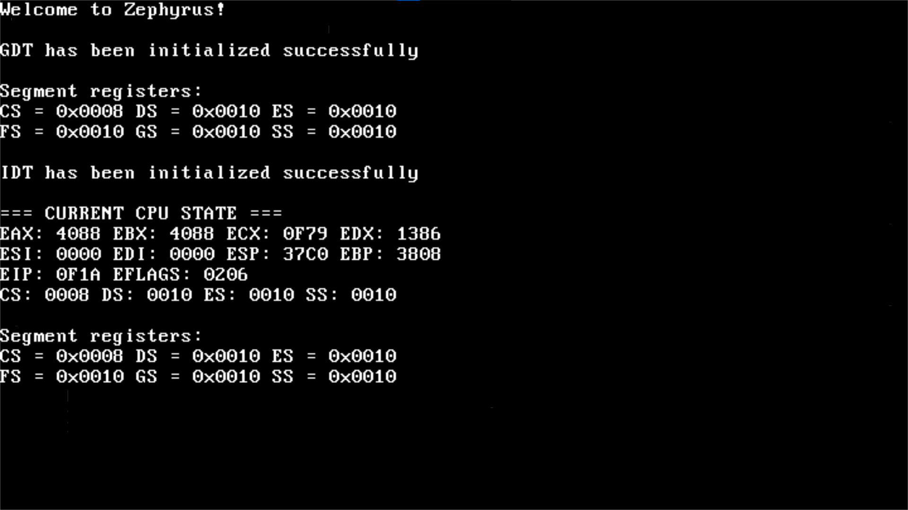

# Zephyrus OS

Zephyrus OS is a hobby x86 operating system kernel I started developing on August 9, 2025.  
This project is ongoing.

---

## Current Features

- Basic VGA text output functions:  
  - Print strings, characters, hex values  
  - Newline, carriage return, and screen scrolling  
- Global Descriptor Table (GDT) implementation  
- Interrupt Descriptor Table (IDT) with basic exception handling  
- Debugging tools for kernel development 
- Basic kernel shell with a few basic commands 
- **Added drivers:**  
  - PIT Timer for system ticks and timekeeping  
  - PS/2 Keyboard driver with shift key support and keyboard input buffer
  - Busy-wait delay function  

---

## Screenshots

---

## Planned Features (TODO)

- Filesystem support  
- Paging
- Additional device drivers (mouse, storage)   

---

## Contributing
This is a personal project, but contributions and suggestions are welcome!

---

## Contact

For questions or feedback, feel free to reach me at: vukmitic81@gmail.com