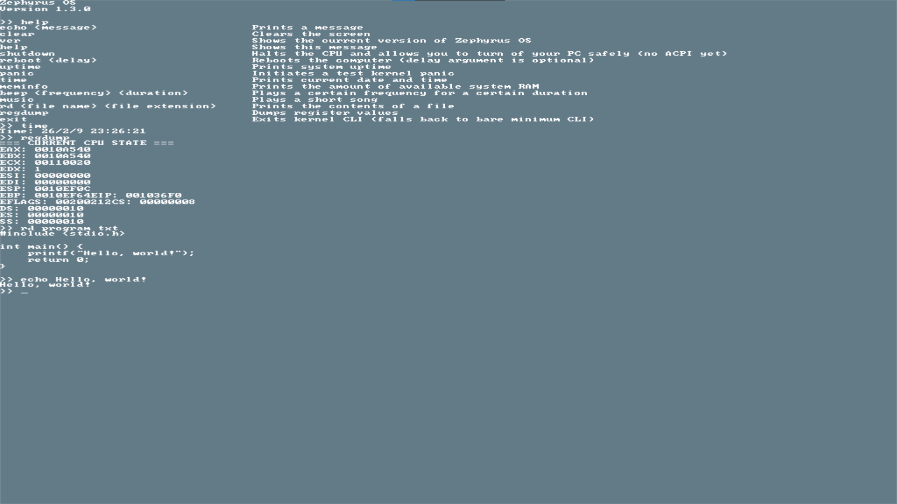
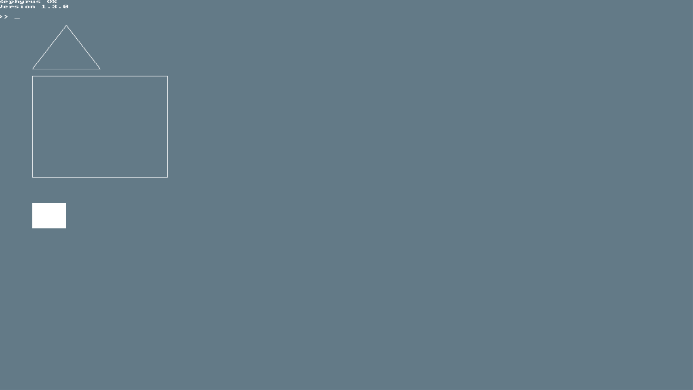

# Zephyrus OS

Zephyrus OS is a hobby x86 operating system kernel I started developing on August 9, 2025.  
This project is ongoing.

---

## Current Features

- **Core Kernel**
  - Text output: print strings, characters, hex values, newline, carriage return, scrolling  
  - Global Descriptor Table (GDT) implementation  
  - Interrupt Descriptor Table (IDT) with basic exception handling  
  - Kernel panic handling with global panic codes  
  - Kernel logging system for debugging and runtime information (via COM1)  
  - Improved kernel heap allocator with detailed heap tests  
  - Exposed Multiboot2 info pointer  

- **Drivers**
  - PIT Timer for system ticks and timekeeping  
  - PS/2 Keyboard driver with shift key support and input buffering  
  - CMOS Real-Time Clock (RTC) driver  
  - PC Speaker driver  
  - COM1 serial driver with boot and runtime logging  
  - ATA Driver (Read only)  

- **Filesystem**
  - RAMFS support via GRUB  
  - Support for the FAT16 filesystem  

- **Kernel shell (CLI)**
  - Command parsing with argument support  
  - Built-in commands (e.g. `echo`, `help`, `time`, etc.)  
  - `meminfo` command (prints available system RAM) **NOTE: CURRENTLY DOES NOT WORK**  
  - `rd` command (prints the contents of a file)  
  - Additional internal commands and fallback CLI  

- **Bootloader**
  - GRUB multiboot2-compliant header in `boot.s`  
  - Bootsplash support  

- **Graphics**
  - Framebuffer graphics (GRUB gfx payload)  
  - Image rendering (currently custom SRI format; BMP support planned)  
  - Line drawing using Bresenham’s algorithm  
  - Triangle, rectangle, and square drawing  
  - Consolidated graphics APIs in `gfx.h` for easy inclusion  
  - Organized drawing code and framebuffer initialization (`init.c/init.h`)  

---

## Screenshots

---

## Planned Features (TODO)

- Reading/writing beyond the root directory  
- Write support  
- Paging  
- Additional device drivers (PS/2 Mouse, more COM ports)  
- Expand font rendering (Currently limited to only an 8x8 font)  
- Support for more image formats (BMP, etc.)  

- **NOTE:**

  - Note: The OS is being transitioned from x86 to x86_64 architecture. As a result, updates and releases may be delayed.

---

## Contributing

This is a personal project, but contributions and suggestions are welcome!

---

## Contact

For questions or feedback, feel free to reach me at: vukmitic81@gmail.com
