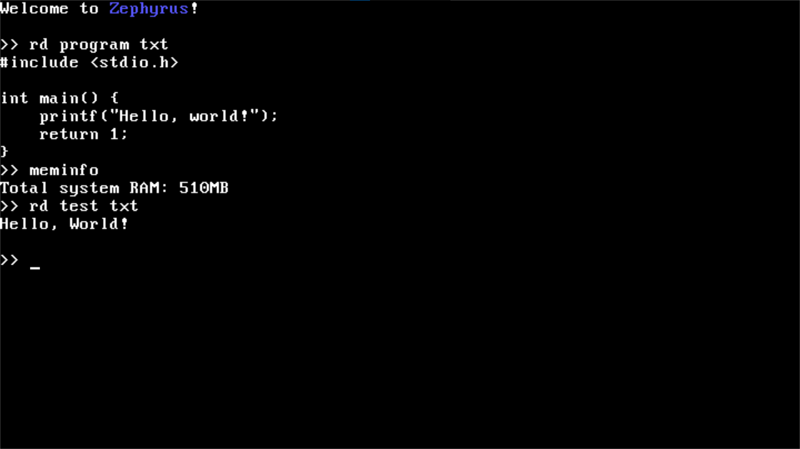

# Zephyrus OS

Zephyrus OS is a hobby x86 operating system kernel I started developing on August 9, 2025.  
This project is ongoing.

---

## Current Features

- **Core kernel**
  - VGA text output: print strings, characters, hex values, newline, carriage return, scrolling  
  - Global Descriptor Table (GDT) implementation  
  - Interrupt Descriptor Table (IDT) with basic exception handling  
  - Kernel panic handling (fatal error reporting)  
  - Kernel logging system for debugging and runtime information  

- **Drivers**
  - PIT Timer for system ticks and timekeeping  
  - PS/2 Keyboard driver with shift key support and input buffering  
  - CMOS Real-Time Clock (RTC) driver  
  - PC Speaker driver
  - ATA Driver (Read only)

- **Filesystem**
 - Support for the FAT16 filesystem

- **Kernel shell (CLI)**
  - Command parsing with argument support  
  - Built-in commands (e.g. `echo`, `help`, `time`, etc.)  
  - `meminfo` command (prints available system RAM)  
  - `rd` command (prints the contents of a file)
  - Additional internal commands and fallback CLI  

- **Bootloader**
  - GRUB multiboot-compliant header in `boot.s`

---

## Screenshots

---

## Planned Features (TODO)

- Reading/writing to more then just the root directory
- Write support 
- Paging  
- Additional device drivers (COM, PS/2 Mouse) 

---

## Contributing
This is a personal project, but contributions and suggestions are welcome!

---

## Contact

For questions or feedback, feel free to reach me at: vukmitic81@gmail.com